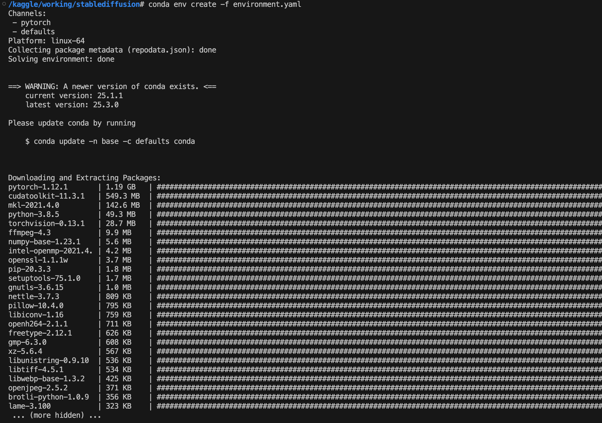
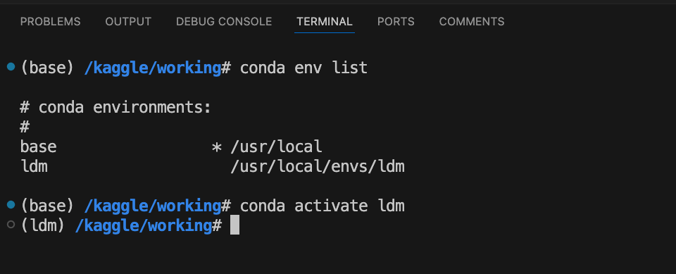
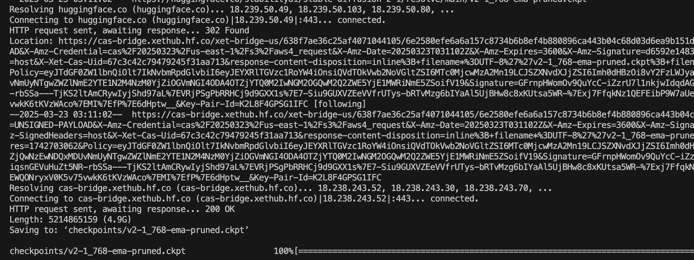
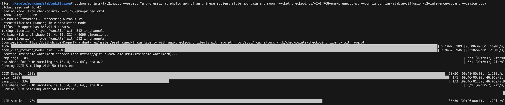
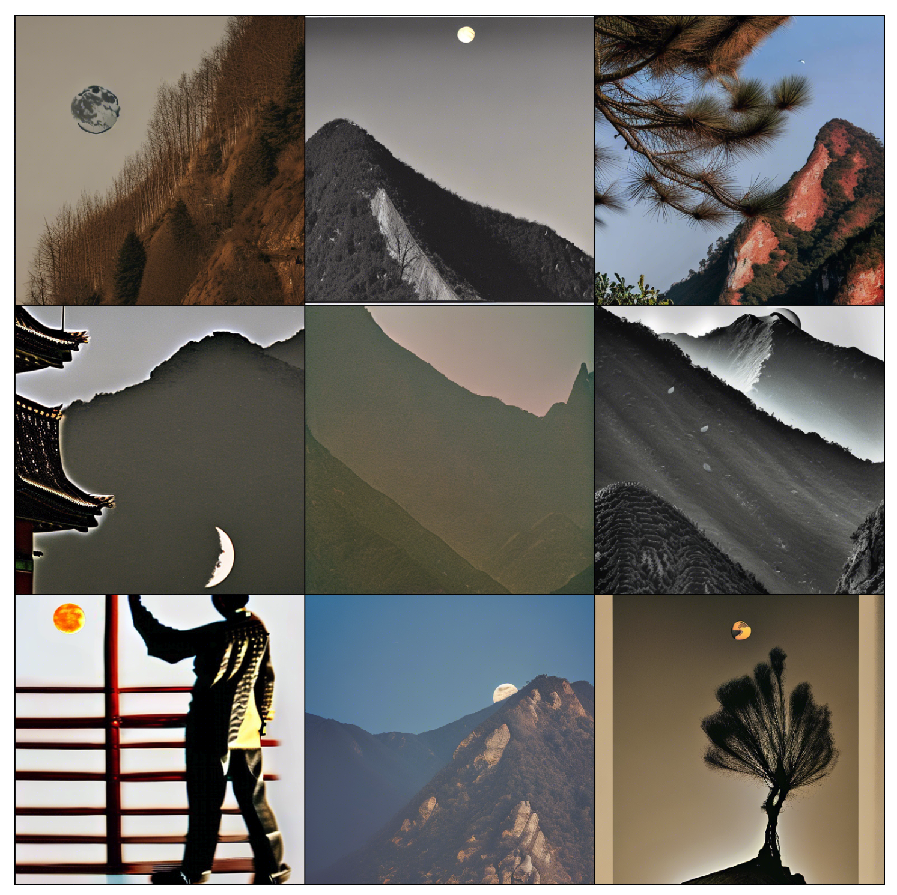

# Local development by remoting into kaggle for Stability-AI/stablediffusion
First setup zrok environment in kaggle and local machine
https://zrok.io/

# Local development environment setup
## Step 1: in kaggle download conda installer and install conda 
```
cd /kaggle/working/
wget https://repo.anaconda.com/miniconda/Miniconda3-latest-Linux-x86_64.sh
chmod +x Miniconda3-latest-Linux-x86_64.sh
./Miniconda3-latest-Linux-x86_64.sh -b -f -p /usr/local
conda --version
```

## Step 2: in local vscode git clone stable-diffusion repo
```
git clone https://github.com/Stability-AI/stablediffusion.git
cd stablediffusion
```

## Step 3: install python virtual environment for stable-diffusion
```
conda env create -f environment.yaml
```


### check if one can activate the virtual environment:
```
conda init
```
### open new terminal
```
conda env list
conda activate ldm
```


## Step 4: download stable-diffusion pretrained model
```
wget --header=<hf_token> \
      -O checkpoints/v2-1_768-ema-pruned.ckpt \
      https://huggingface.co/stabilityai/stable-diffusion-2-1/resolve/main/v2-1_768-ema-pruned.ckpt
```


## Step 5: run txt2img script to generate images
### Depends on the <kaggle_token> generated from which type of kaggle machine, you will be able to use cuda or cpu only. (This SD repo may not work with cpu.)
```
python scripts/txt2img.py --prompt "a professional photograph of an chinese accient style mountain and moon" --ckpt checkpoints/v2-1_768-ema-pruned.ckpt --config configs/stable-diffusion/v2-inference-v.yaml --device cuda 
```


### Sample generated images:

#### Mountain: Chinese Style


#### Mountain: Japanese Style


#### Mountain: Switzerland Style


## Sync kaggle content with local vscode
### from local to remote
```
rsync -e "ssh -o UserKnownHostsFile=/dev/null -o StrictHostKeyChecking=no -i ~/.ssh/kaggle_rsa -p 9191" <path_to_the_local_file> root@127.0.0.1:/kaggle/working
```
```
-e: Specifies the remote shell to use

SSH options in quotes:

-o UserKnownHostsFile=/dev/null: Ignores host key checking
-o StrictHostKeyChecking=no: Disables strict host key checking
-i ~/.ssh/kaggle_rsa: Uses the Kaggle SSH private key

-p 9191: Connects through port 9191
<path_to_the_local_file>: Your source file/directory

root@127.0.0.1:/kaggle/working: Destination
root: Username on Kaggle
127.0.0.1: Local loopback address (tunneled to Kaggle)

/kaggle/working: Destination directory on Kaggle
```
### from remote to local
```
rsync -e "ssh -o UserKnownHostsFile=/dev/null -o StrictHostKeyChecking=no -i ~/.ssh/kaggle_rsa -p 9191" root@127.0.0.1:<path_to_the_remote_file> <destination_path_in_local>
```
```
SSH flags (specified with -e):
-o UserKnownHostsFile=/dev/null: Skips host key verification
-o StrictHostKeyChecking=no: Disables SSH strict host checking
-i ~/.ssh/kaggle_rsa: Uses your Kaggle SSH private key
-p 9191: Connects through port 9191

Source: root@127.0.0.1:<path_to_the_remote_file>
root: Kaggle username
127.0.0.1: Local loopback (tunneled)

<path_to_the_remote_file>: File path on Kaggle
Destination: <destination_path_in_local> (your local machine)
```